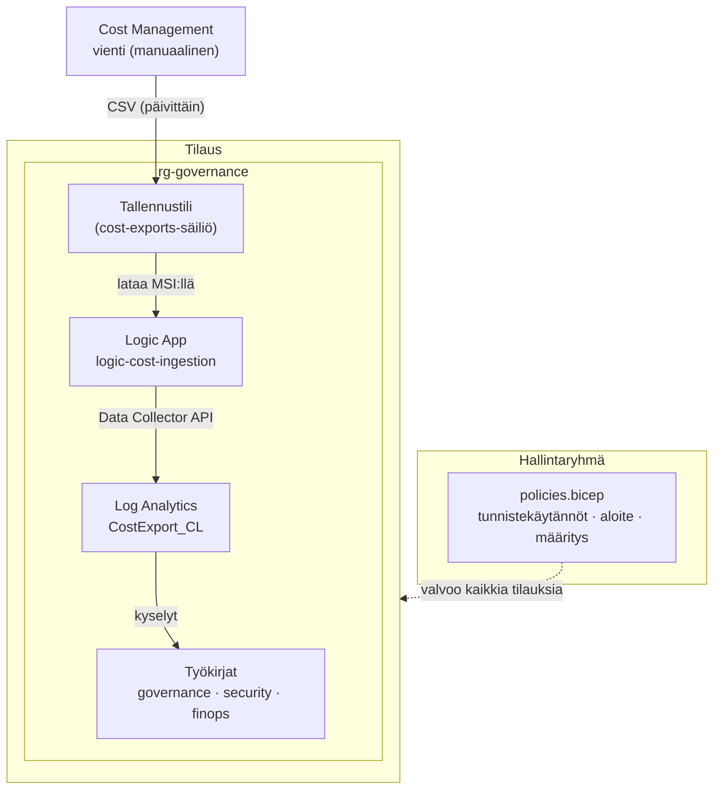

# Arkkitehtuuri

Ratkaisu koostuu kahdesta toisistaan riippumattomasta käyttöönotosta, jotka kohdistuvat eri tasoihin: **käytännöt** otetaan käyttöön hallintaryhmässä ja koskevat kaikkia alatilauksia, kun taas **resurssit** (työkirjat ja valinnainen kustannusputki) otetaan käyttöön yhdessä tilauksessa.

| Taso | Käyttöönotto | Sisältö |
|------|--------------|---------|
| Hallintaryhmä | `policies.bicep` | Tunnistekäytännöt, aloite, määritys (hallitulla identiteetillä) ja rooliosoitus — koskee kaikkia alatilauksia. |
| Tilaus | `resources.bicep` | Resurssiryhmä, kolme työkirjaa ja valinnainen kustannusputki (tallennustili + Log Analytics + Logic App). |

Kustannusputki on **valinnainen** ja kytketään päälle parametrilla `deployCostManagement = true`. Itse Cost Management -vienti luodaan **manuaalisesti** (ks. [Kustannustenhallinta ja FinOps](cost-management.md)), jolloin sen tason (tilaus tai hallintaryhmä) voi valita itse.

## Käytännöt

| Käytäntö | Vaikutus | Toiminta |
|--------|--------|----------|
| `require-tag-on-resource-group` | `Deny` (määritettävissä) | Estää sellaisen resurssiryhmän luonnin tai päivityksen, josta puuttuu pakollinen tunniste (esim. `owner`). |
| `inherit-tag-from-resource-group` | `modify` | Kun resurssi luodaan tai päivitetään ja sen yläresurssiryhmällä on tunnisteelle ei-tyhjä arvo, resurssi saa saman tunnisteen/arvon. |
| `allowed-tag-values` | `Audit` (määritettävissä) | Merkitsee resurssit/resurssiryhmät, joiden tunnisteen arvo ei ole sallittujen listalla (vain kun tunniste on olemassa). |

Jokainen käytäntömääritys on **uudelleenkäytettävä** (parametroitu tunnisteen nimellä) ja viitataan kerran kutakin hallittua tunnistetta kohden. Ne on koottu yhteen **aloitteeseen** (`tag-governance-initiative`) ja määritetään kerran **hallintaryhmän** tasolla, joten säännöt koskevat automaattisesti kaikkia nykyisiä ja tulevia alatilauksia.

### Huomioita käytännöistä

- `inherit-tag-from-resource-group` käyttää `mode: 'Indexed'`, joten se kohdistuu vain resursseihin, jotka tukevat tunnisteita ja sijainteja.
- `allowed-tag-values` arvioidaan vain kun tunniste on olemassa, joten se täydentää (ei toista) require-käytäntöä.
- Käytäntösääntöjen lausekkeet kääntyvät ARM-muotoon `[[concat(...)]` / `[[resourceGroup()...]`. Kaksoishakasulku on tarkoituksellinen: ARM purkaa sen literaaliksi merkkijonoksi, jonka Policy-moottori arvioi ajonaikana.
- Tunnisteiden avaimet ovat **kirjainkoon erottelevia** Azuren kustannusraporteissa — pidä nimeäminen johdonmukaisena (oletukset käyttävät PascalCase-muotoa).
- Kohteiden lisääminen tai poistaminen `tags`-listasta luo aloitteen viittaukset uudelleen seuraavalla käyttöönotolla.

## Tiedostot

Ratkaisu on jaettu **kahteen käyttöönottoon**, koska ne kohdistuvat eri tasoihin:

- `policies.bicep` — **hallintaryhmän** taso: tunnistekäytännöt, aloite, määritys ja rooliosoitus.
- `resources.bicep` — **tilauksen** taso: resurssiryhmä, työkirjat ja kustannusanalytiikka.

| Tiedosto | Taso | Tarkoitus |
|------|-------|---------|
| `policies.bicep` | `managementGroup` | Tunnistelista, aloite, määritys (hallitulla identiteetillä) ja rooliosoitus. |
| `resources.bicep` | `subscription` | Resurssiryhmä, työkirjat ja kustannusanalytiikka. |
| `modules/policy-definitions.bicep` | `managementGroup` | Kolme uudelleenkäytettävää mukautettua käytäntömääritystä. |
| `modules/workbook.bicep` | `resourceGroup` | Uudelleenkäytettävä moduuli, joka ottaa käyttöön Azure Monitor -työkirjan. |
| `modules/cost-analytics.bicep` | `resourceGroup` | Tallennustili, Log Analytics -työtila ja Consumption Logic App kustannusdatan sisäänlukua varten. |
| `workbooks/governance.json` | — | Sarjallistettu hallintatyökirjan sisältö, joka upotetaan käännösaikana `loadTextContent`-funktiolla. |
| `workbooks/security.json` | — | Sarjallistettu tietoturvatyökirjan sisältö, joka upotetaan käännösaikana `loadTextContent`-funktiolla. |
| `workbooks/finops.json` | — | Sarjallistettu FinOps-/kustannustenhallintatyökirja (kyselee `CostExport_CL`-taulua). |
| `policies.bicepparam` | — | Parametriarvot käytäntöjen käyttöönotolle (hallittu tunnistelista ja vaikutukset). |
| `resources.bicepparam` | — | Parametriarvot resurssien käyttöönotolle (resurssiryhmän ja kustannusanalytiikan nimet). |
