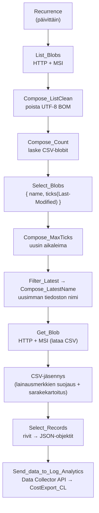

# Kustannustenhallinta ja FinOps

> Edellyttää, että kustannustenhallintaresurssit on otettu käyttöön ensin (`deployCostManagement = true`). Kun kytkin on `false`, tallennustiliä, työtilaa, Logic Appia ja FinOps-työkirjaa ei luoda, eikä tämä osio koske sinua.

## Kustannusviennin luonti (manuaalinen)

Tallennustili, Log Analytics -työtila ja Logic App otetaan käyttöön `resources.bicep`-tiedostolla, mutta **Cost Management -vienti** luodaan manuaalisesti, jotta voit valita sen tason (tilaus tai hallintaryhmä). Hae tallennustilin nimi `resources.bicep`-käyttöönoton tulosteesta `costStorageAccountName`.

Luo vienti portaalissa (**Cost Management > Exports > Create**) tai CLI:llä. Osoita kohde käyttöön otettuun tallennustiliin ja `cost-exports`-säiliöön.

**Tilaustaso:**

```powershell
az costmanagement export create `
  --name tag-governance-cost-export `
  --scope "/subscriptions/<your-subscription-id>" `
  --storage-account-id "/subscriptions/<your-subscription-id>/resourceGroups/rg-governance/providers/Microsoft.Storage/storageAccounts/<costStorageAccountName>" `
  --storage-container cost-exports `
  --storage-directory exports `
  --type ActualCost `
  --dataset-granularity Daily `
  --recurrence Daily `
  --recurrence-period from=<yyyy-MM-dd> to=2030-12-31 `
  --schedule-status Active
```

**Hallintaryhmän taso:** käytä sen sijaan `--scope "/providers/Microsoft.Management/managementGroups/<your-mg-id>"`.

## Tietomalli (`CostExport_CL`)

Kun viennit alkavat saapua `cost-exports`-säiliöön, Logic App suoritetaan kerran vuorokaudessa ja kirjoittaa rajatun osajoukon Log Analyticsin mukautettuun tauluun **`CostExport_CL`**, jossa on sarakkeet:

| Sarake | Kuvaus |
|--------|--------|
| `Date_s` | Käyttöpäivä. |
| `SubscriptionId_s` | Tilauksen GUID. |
| `SubscriptionName_s` | Tilauksen nimi. |
| `ResourceGroup_s` | Resurssiryhmän nimi. |
| `ResourceId_s` | Resurssin koko tunnus. |
| `ConsumedService_s` | Käytetty Azure-palvelu. |
| `MeterCategory_s` | Mittarin kategoria. |
| `Currency_s` | Laskutusvaluutta. |
| `Tags_s` | Resurssin tunnisteet (JSON-merkkijono). |
| `Cost_d` | Kustannus laskutusvaluutassa. |
| `Snapshot_s` | Käytetyn vientitiedoston nimi (deduplikointia varten). |

Koska MonthToDate-vienti vie koko kuukauden tiedot päivittäin uudelleen, käytä `Snapshot_s`-saraketta suodattamaan uusimpaan vientiin, jotta kustannuksia ei lasketa kahteen kertaan. Osoita työkirjan kyselyt tähän tauluun, esim.:

```kusto
let latestSnap = toscalar(CostExport_CL | summarize arg_max(TimeGenerated, Snapshot_s) | project Snapshot_s);
CostExport_CL
| where Snapshot_s == latestSnap
| summarize TotalCost = sum(Cost_d) by ResourceGroup_s
| order by TotalCost desc
```

## Kustannusten sisäänluvun Logic App -putki

Logic App (`logic-cost-ingestion`) on Consumption-tyyppinen työnkulku, joka suoritetaan **kerran vuorokaudessa** ja siirtää viedyn CSV-datan Log Analyticsiin. Tallennustilissä **jaettujen avainten käyttö on estetty** (`allowSharedKeyAccess: false`), joten kaikki blob-haku tapahtuu työnkulun **järjestelmän osoittamalla hallitulla identiteetillä** (HTTP + Blob REST API, ei `azureblob`-liitintä). Identiteetille on myönnetty **Storage Blob Data Reader** -rooli säiliöön.



### Vaiheet

| Vaihe | Toiminnot | Tarkoitus |
|-------|-----------|-----------|
| **Liipaisin** | `Recurrence` | Suoritus kerran vuorokaudessa. Vientien saapumista ei seurata blob-liipaisimella, koska Cost Management kirjoittaa tiedostot sisäkkäisiin alikansioihin. |
| **Listaus** | `List_Blobs`, `Compose_ListClean`, `Compose_Count` | Litteä blob-listaus (REST) MSI:llä löytää tiedostot myös sisäkkäisistä kansioista. Vastauksesta poistetaan mahdollinen UTF-8 BOM, jotta `xml()`/`xpath` toimii. |
| **Uusimman valinta** | `Select_Blobs`, `Select_Ticks`, `Compose_MaxTicks`, `Filter_Latest`, `Compose_LatestName` | Jokainen CSV-blobi projisoidaan muotoon `{ name, ticks }` ja valitaan suurimman `Last-Modified`-aikaleiman tiedosto (= uusin tilannevedos). |
| **Lataus** | `Get_Blob` | Lataa uusimman CSV-tiedoston sisällön hallitulla identiteetillä. |
| **Jäsennys** | `Compose_Protected` → `Compose_Cleaned` → `Compose_Lines` → `Filter_Empty` → `Compose_Lookup` | Suojaa lainausmerkein ympäröidyt kentät (pilkut, rivinvaihdot, kahdennetut lainausmerkit) ennen pilkku-/rivijakoa, sitten rakentaa otsikkoriviltä `{ sarakenimi: indeksi }` -hakutaulun, jotta sarakkeet kartoitetaan **nimen** eikä kiinteän sijainnin mukaan. |
| **Kartoitus** | `Select_Records` | Muuntaa kunkin datarivin JSON-objektiksi, palauttaa suojatut merkit ja lisää `Snapshot`-kentän (vientitiedoston nimi). Puuttuvat vaihtoehtoiset sarakkeet tuottavat tyhjän arvon turvallisesti. |
| **Lähetys** | `Send_data_to_Log_Analytics` | Lähettää rivit Data Collector API:n kautta mukautettuun tauluun `CostExport_CL`. |

### Suunnitteluvalinnat ja sudenkuopat

- **Hallittu identiteetti, ei jaettua avainta.** Vanha `azureblob`-liitin ei tue hallittua identiteettiä (vaatii tilin nimen / jaetun avaimen), joten blob-toiminnot tehdään suoraan Blob REST API:lla `ManagedServiceIdentity`-todennuksella (`audience: https://storage.azure.com/`, `x-ms-version: 2021-08-06`).
- **Litteä listaus sisäkkäisten kansioiden vuoksi.** Cost Management kirjoittaa tiedostot polkuun `exports/<nimi>/<aikaväli>/<guid>/file.csv`, jota blob-liipaisin ei seuraa. Litteä listaus löytää ne kaikki.
- **Tilannevedoksen mukainen deduplikointi.** MonthToDate-vienti vie koko kuukauden uudelleen joka päivä. `Snapshot_s`-kenttä (vientitiedoston nimi) mahdollistaa kyselyiden rajaamisen uusimpaan vientiin, jottei kustannuksia lasketa kahteen kertaan.
- **Vankka CSV-jäsennys.** Lainausmerkein ympäröidyt kentät (kuten `Tags`) voivat sisältää pilkkuja ja rivinvaihtoja; ne suojataan ennen jakoa ja palautetaan jäsennyksen jälkeen.
- **Pakkaamaton CSV.** Putki olettaa pakkaamatonta CSV:tä (Cost Managementin oletus). Gzip-/Parquet-vienti rikkoisi jäsentimen.
